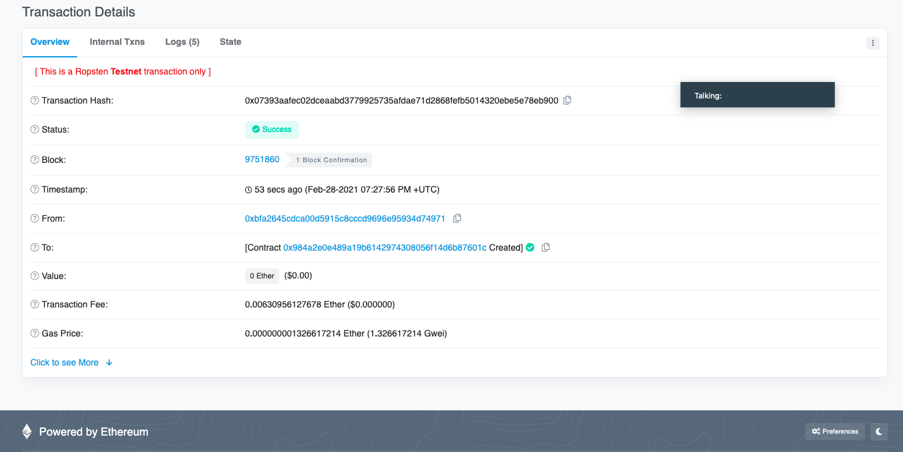

# Unit 21: You sure can attract a crowd!

## Background

In this project I'm going to crowdsale my company's PupperCoin token in order to help fund the network development with 300 ETH. The crowdsale will run for 24 weeks to meet this Goal. To make this Token I'll create an ERC20 token that will mint a 'CrowdSale' contract using OpenZeppelin Soldidity Library.

This will allow users to send ETH and get back PUP (PupperCoin). This contract will mint the tokens automatically and distribute them to buyers in one transaction.

*I will need to add these the following in this contract:*
1. Crowdsale 
2. CappedCrowdsale
3. TimedCrowdsale
4. RefundableCrowdsale
5. MintedCrowdsale

I will also change my Crypto App network to Kovan or Ropsten testnet in order to get a real-world pre-production test in.

### Creating my project

Using Remix, I create a file called `PupperCoin.sol` and create a standard `ERC20Mintable` token. I will also create another new contract named `PupperCoinCrowdsale.sol`, and prepare it like a standard crowdsale. After Compiling and Deploying I was able to send the below transaction.

# Transaction Details

